## 📣 중앙인재 개발원 2차  기업 프로젝트 (선도소프트) -수자원 종합플렛폼

# 📖 프로젝트 개요

##  프로젝트 소개 
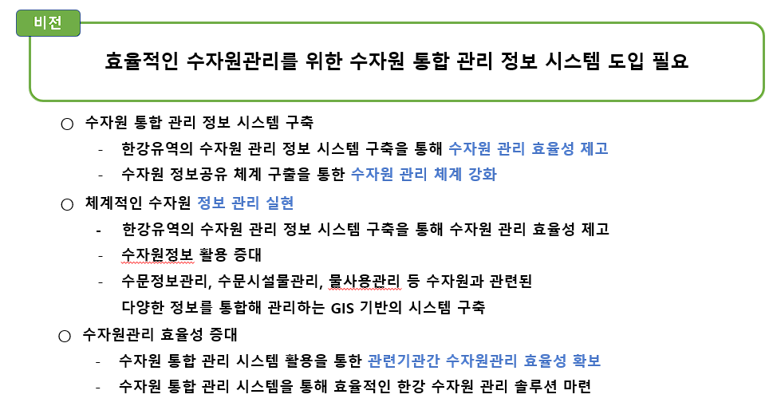  

<a href="https://drive.google.com/file/d/1Pdt8rNXoo7mZznG5XDXsVw1NwMi4ak95/view?usp=drive_link">📌 프로젝트 전체 PPT 보기</a>📌 

## 📚 개발환경

- 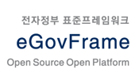
- 
- 
-  ➕ 
- 

- 
- 

## 시스템 구성도

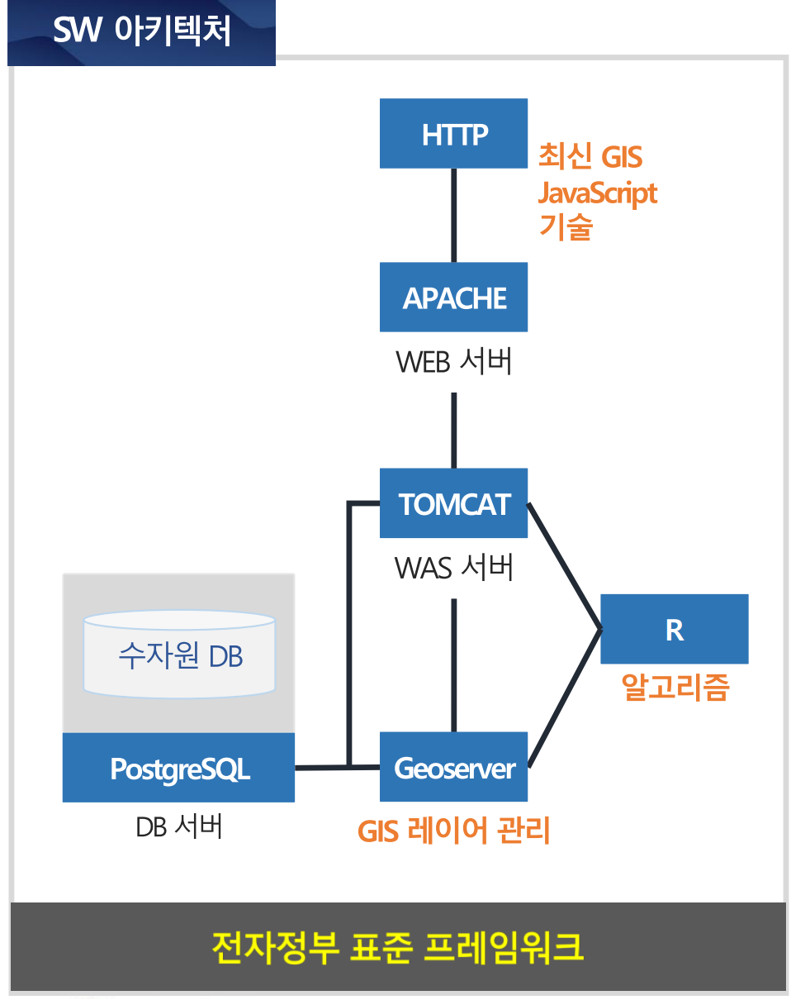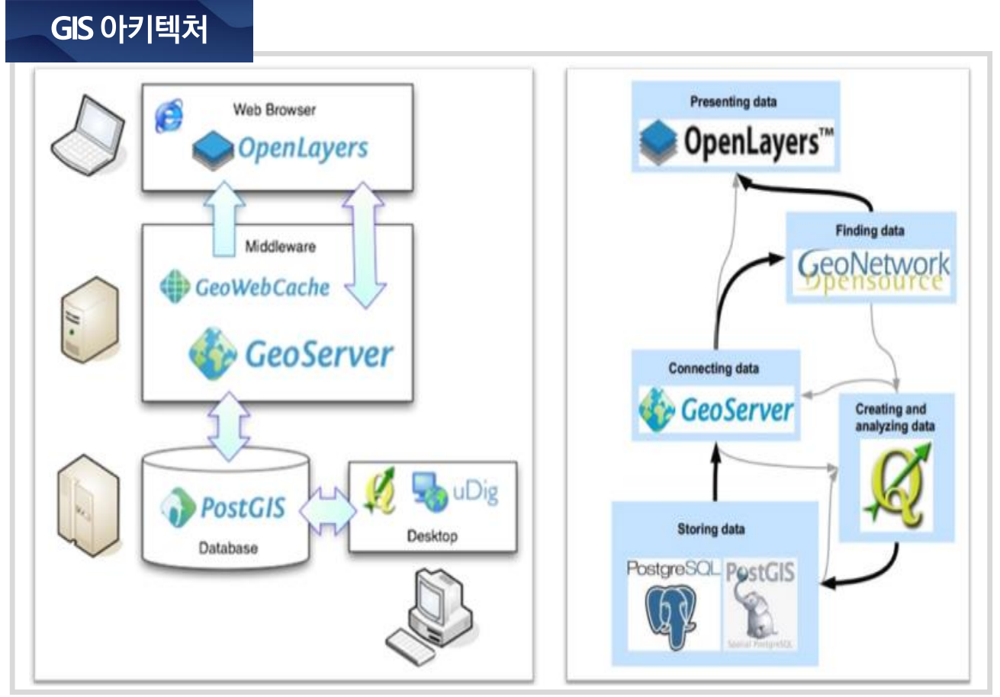

##  프로젝트 기간
 🕛2023.12.4 - 2024.1.3

## 프로젝트 구조
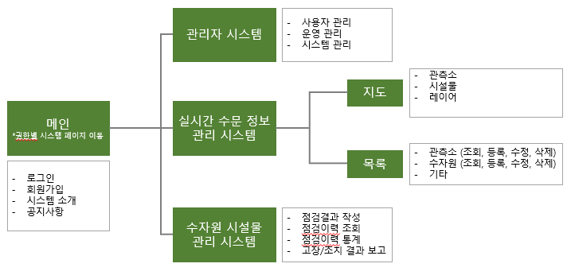

## 프로젝트 팀원 및 역할
👑🧑 조장 이광현 (LKH) : 프로젝트 총괄/일정관리 , 실시간 수문 정보관리시스템(1.지도구현, 
2.수자원 시설물 관리 게시판)

🧑부조장 강준우 (KJO) : 전자정부프레임워크 환경설정 , 수자원 시설물 관리시스템(1.점검 결과 작성, 2.점검이력조회)

👩팀원 이진희 (LJH) : 수자원 시설물 관리시스템(1.고장/조치 결과보고, 2.점검 이력 통계)

👩팀원 황인정 (HIJ) : 실시간 수문 정보 관리시스템(1. 관측소 관리 게시판, 2.관측소 정보통계)

👩 팀원 조미혜 (JMH) : 관리자 시스템(1.사용자관리,2.운영관리, 3.시스템관리)

## 🔭 나의 구현 기능

## 🔥 실시간 수문 정보 관리시스템-지도  🔥  

:question: Geoserver를 이용하여 웹화면에 지도를 그리는 과정

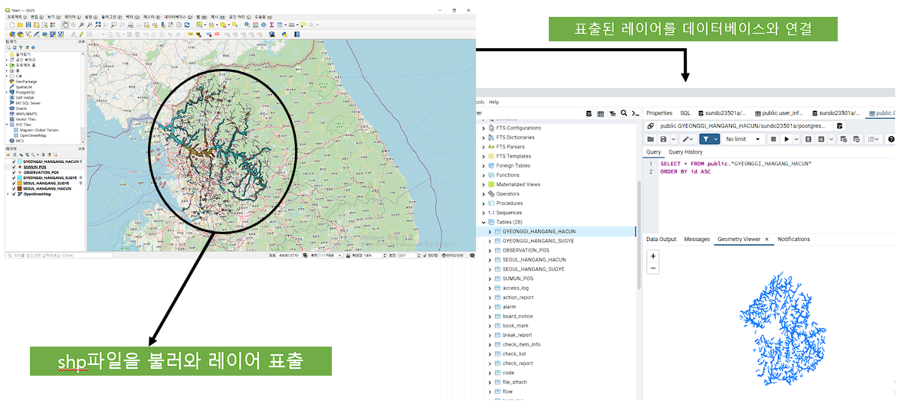
1. 먼저 제공받은 기업에서 제공받은 shp파일을 QGis로 읽어 지도를 불러옵니다.  
여기서 QGis 오픈 소스 기반의 지리정보시스템 소프트웨어입니다. 이 소프트웨어는 사용자가 지리 공간 데이터를 불러오고 편집, 시각화하고 분석하는데 사용합니다.  
2. 이 qgis로 불러온 shp파일을 PostSQL와 연동시켜 데이터베이스안에 이 지리공간 데이터를 저장합니다. 참고로 PostSQL은 이러한 공간적 데이터베이스에 대해 특화되어있습니다.

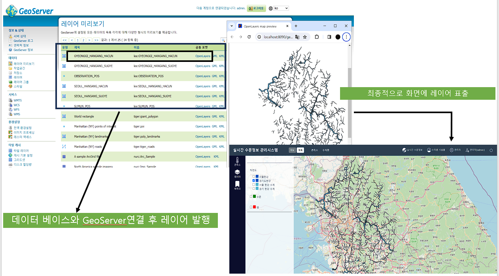
3. 그 다음 지리정보가 들어있는 데이터베이스와 GeoServer를 연동시켜서 해당 지리정보의 레이어를 생성합니다.   
4. 그 후에 GeoServer에서 제공되는 기능으로 지도 데이터를 가져와 openlayers로 레이어를 그립니다. 
Openlayers는 javascript 기반의 오픈 소스 라이브러리로 웹 상에서 지도와 지리정보를 표시하고 상호 작용하는데 사용됩니다.
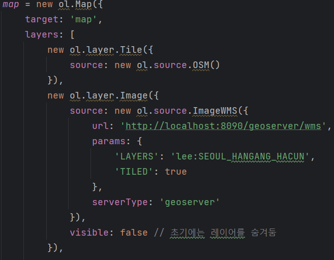

### 🔥 지역별 Polygon, point형식의 레이어 생성 및 쌓기 🔥  
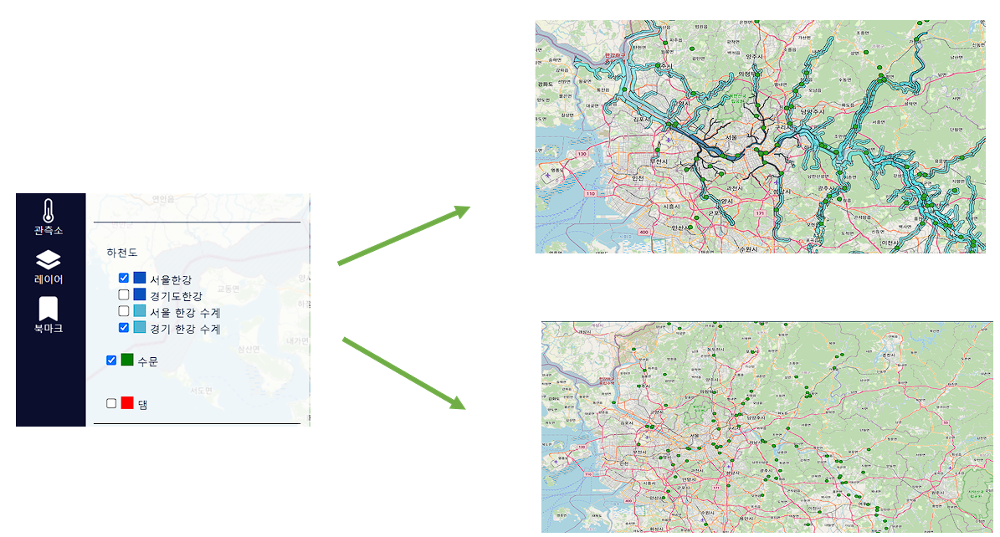
체크박스의 체크여부에 따라 해당 레이어가 표시 여부가 결정됩니다.

### 🔥 관측소 클릭 시 해당 좌표로 이동 및 관측소 정보 팝업 표시 🔥 
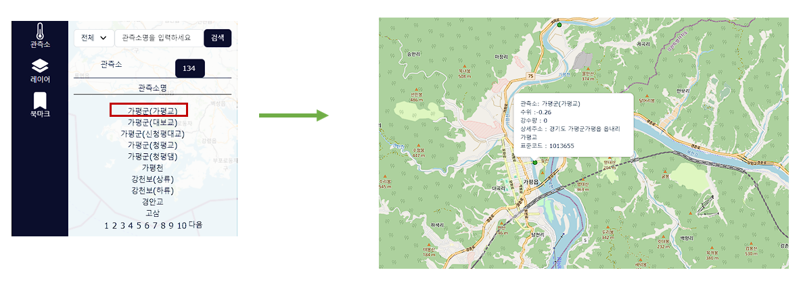

관측소 리스트에 잇는 관측소를 클릭하면 해당 좌표로 이동 후 해당 관측소에 정보가 표출됩니다.

## 🔥 실시간 수문 정보 관리시스템-게시판 🔥  

### 🔥 목록 🔥  
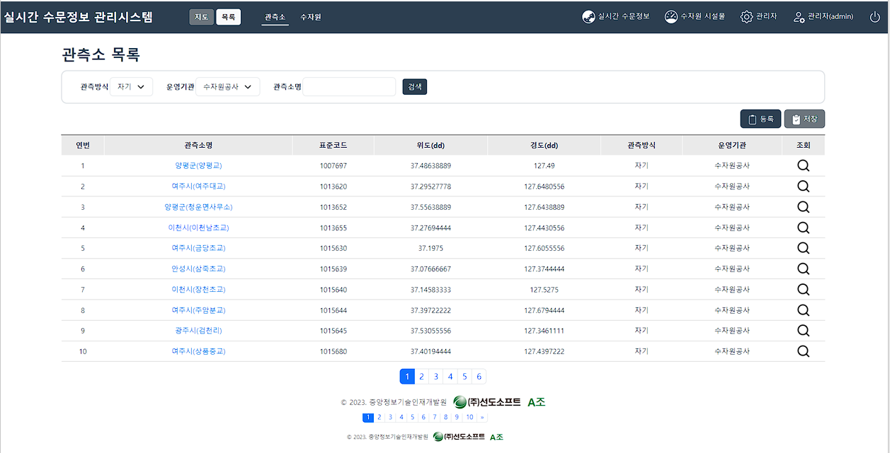

### 🔥 통계 🔥  
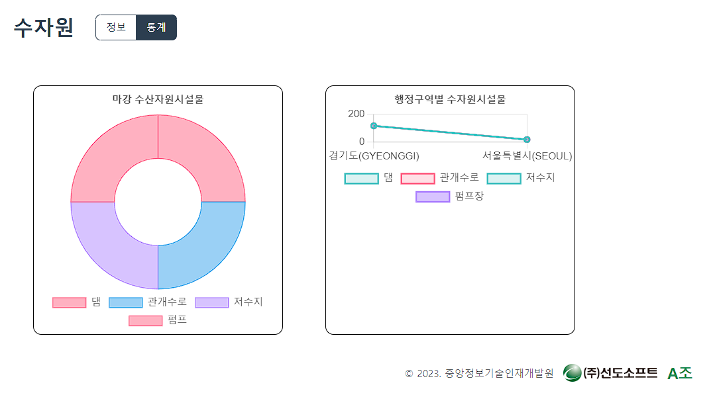

### 🔥 상세화면, 등록 ,수정, 삭제 🔥  
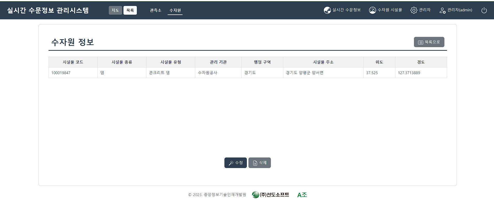
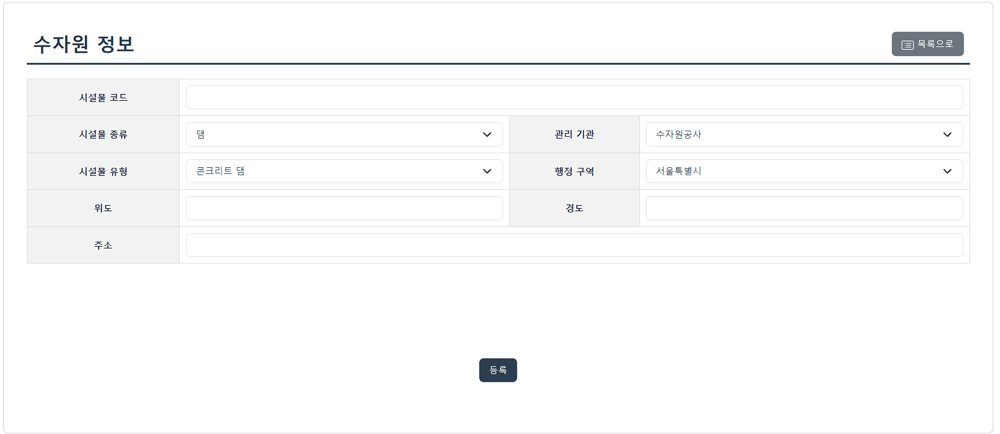
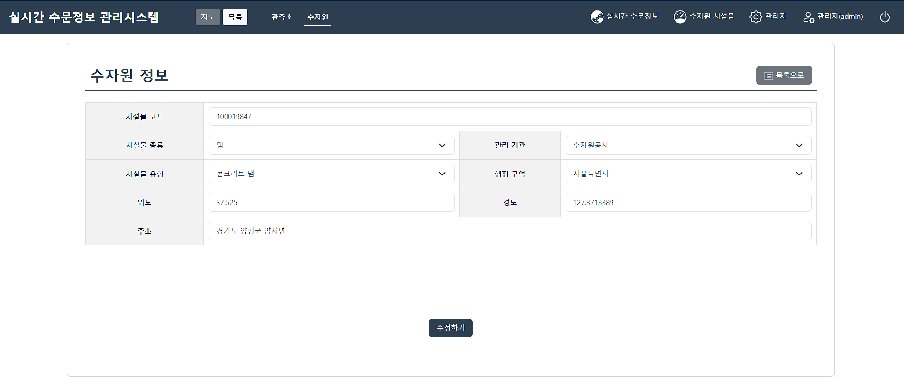

 
 

---
## 📌 프로젝트 회고 

기업에서 요구하는 프로젝트를 진행하면서, 개발하는 것만큼이나 프로젝트의 유지보수와 산출물 작성의 중요성을 깨달았습니다. 프로젝트가 끝난 이후에도 산출물을 기반으로 한 유지보수가 중요하다는 것을 몸소 느꼈습니다. 

팀장으로서의 경험은 리더십과 의사 결정의 중요성을 크게 이해하게 되었습니다. 프로젝트의 성공 여부는 팀 내에서의 결정과 소통에 크게 의존하기 때문에, 신중하고 효과적인 의사 결정이 필요했습니다. 이를 통해 리더십 역량을 강화할 수 있었습니다.

각 팀원의 의견을 수렴하고 통합하는 과정에서 소통의 중요성을 다시 한번 깨닫게 되었습니다. 

아쉬운 점으로는 주어진 화면설계서와 처음 접하는 다양한 데이터들(수량,강수량,수자원시설물)을 해석하고 산출물 및 개발을 진행하는 데에 시간이 부족했습니다. 더 많은 시간이 있었다면 프로젝트의 완성도를 높일 수 있었을 것으로 생각됩니다.

  
  

